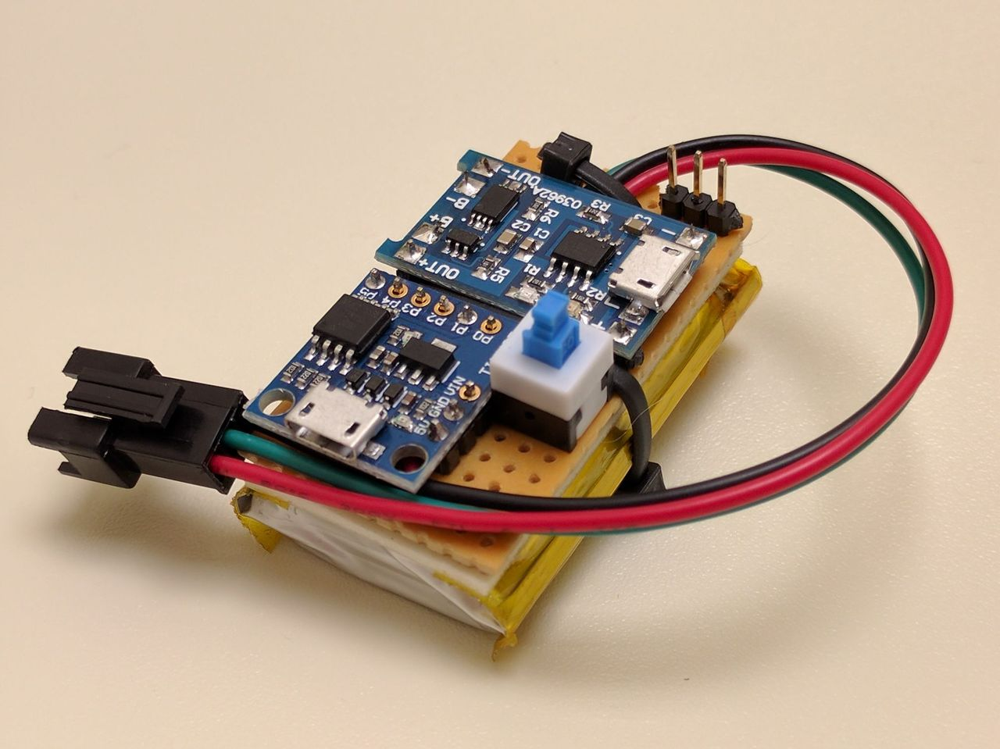

### WS2812B / Adafruit NeoPixel RGB LED players, effects and platforms

**Note**: Work in progress. For any questions, feel free to [create an issue](https://github.com/rogerdahl/ws2812b-neopixel-stuff/issues/new).

There are many platforms and libraries for controlling WS2812B / Adafruit NeoPixel RGB LEDs. However, they're all slightly different, so code written for one platform and library won't work on any other without modifications. This project defines an abstraction layer that allows separating code that controls WS1212B into **players** and **effects**, and implements various components of each type. Also included are instructions for how to build **platforms** that can run the players and effects.

**Players**: Players are platform and library specific. Implementing a player for a given platform and library allows the platform to run all effects, without modifying any code in the effects.  

**Effects**: Effects are platform agnostic. An effect implements an animation by describing how the color of each LED should change over time. After implementing an effect, it can be used on any platform for which there is a player.

**Platforms**: Physical devices that can run the players.

#### Players

This project currently contains players for the following platforms:
 
   

* [Player and Emulator for Windows, Linux, Mac, Pi](players/emulator)
    * Emulates the LEDs by drawing them on screen using OpenGL
    * Enables fast effect development and debugging
    * Cross-platform, tested on Windows and Linux

* [Player for Raspberry Pi](players/raspberrypi)
    * For high-powered stationary displays running many LEDs and/or running animations as part of a larger system, such as dynamically updated stock tickers.

* [Player for Atmel AVR ATtiny85](players/attiny85)
    * For DIY wearables

* [Player for STMicroelectronics STM32](players/stm32)
    * For wearables and stationary displays, depending on which version of the STM32 μC is used
   

#### Effects
 
A variety of effects is included. 

#### Platforms

Instructions on how to build devices that can run the players and effects.

* [Small platform for wearable projects based on the ATTiny85](platforms/attiny85)

#### Implementation

Players and effects are implemented in C++ and use regular polymorphism. The abstraction layer is defined in two simple abstract base classes. Players and effects each extend one of the classes and override a couple of pure virtual functions, allowing them to communicate via virtual calls.

Effects provide a single function, `refresh()` and players provide three functions, `get()`, `set()` and `len()`. The player calls `refresh()` 50 times per second to update the LEDs. The effect then calls `len()` to find the total number of LEDs, and `get()` and `set()` to read and modify the colors of the LEDs. When receiving the calls, the player in turn interacts with the underlying LED library (using the native interface provided by the library) to read or update the LEDs.   

This approach was chosen as opposed to having `refresh()` return an array of LED colors so that players could be implemented on μCs like the ATtiny85, which have only a few hundred bytes of free RAM and cannot fit a copy of all the LED colors in memory.    

Note that this is not a plugin system. The approach makes players and effects interchangeable, but the player and effects are combined to a single binary at compile time.

On most platforms, players can be compiled with any number of the effects and can cycle through them if desired. Extremely limited platforms such as the ATtiny85 can probably store just a few effects, and the effects must carefully control their memory usage. 
