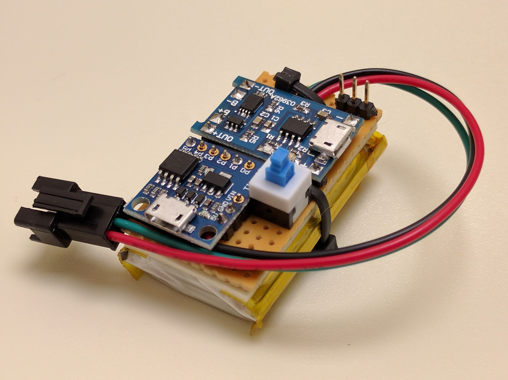
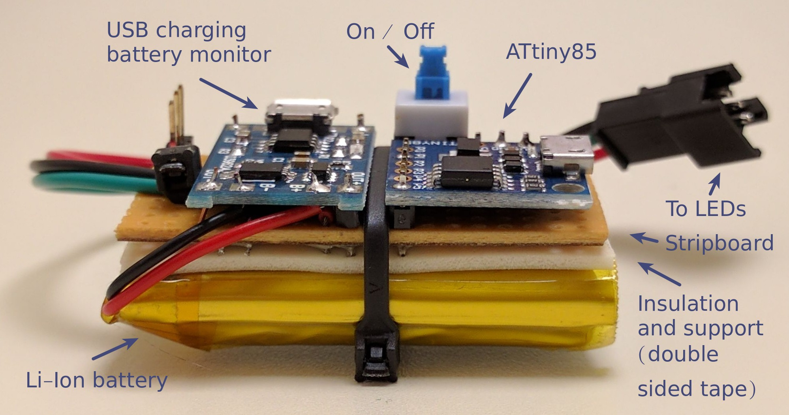

### Small platform for wearable projects based on the ATTiny85

**Note**: Work in progress. For any questions, feel free to [create an issue](https://github.com/rogerdahl/ws2812b-neopixel-stuff/issues/new).

